# `__future__` — Future statement definitions

`__future__` module is a built-in module in Python that is used to inherit new features that will be available in the new Python versions..

This module includes all the latest functions which were not present in the previous version in Python. And we can use this by importing the `__future__` module. Its releases are in Python version 2.1. The basic idea of the `__future__` module is to help migrate to use Python 3.X features.

> Note: The future statements must at the top of the file, otherwise the Python interpreter will raise SyntaxError

## Following features in this module

Features                 | Optional in | Mandatory in
-------------------------|-------------|-------------
**nested_scopes**        | 2.1         | 2.2
**generators**           | 2.2         | 2.3
**division**             | 2.2         | 3.0
**absolute_import**      | 2.5         | 3.0
**with_statement**       | 2.5         | 2.6
**print_function**       | 2.6         | 3.0
**unicode_literals**     | 2.6         | 3.0
**generator_stop**       | 3.5         | 3.7
**annotations**          | 3.7         | 3.11

## Basic features in future module

There are seven features in Python future module.

### [All future names](./Examples/1_example.py)

[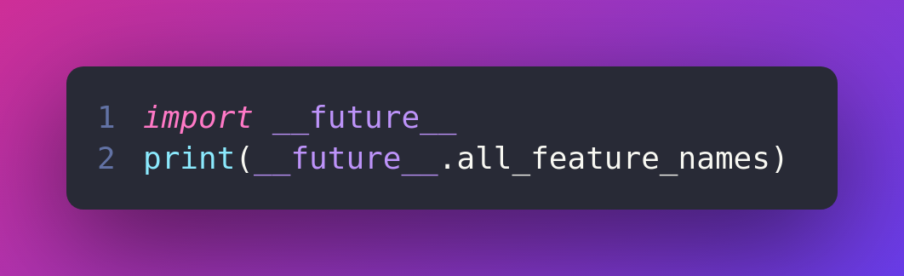](./Examples/1_example.py)

***Output***

>['nested_scopes',  
>'generators',
>'division',
>'absolute_import',
>'with_statement',
>'print_function',
>'unicode_literals']

## `__future__` module with print_function

***[Example 1:](./Examples/2_example.py)***

The Python2 print statement is different from Python3 print function. We use the Python print statement in Python2 as:

> `print "Hello world"`

But we can use the Python3 print function in the Python2 function using the future modules.

[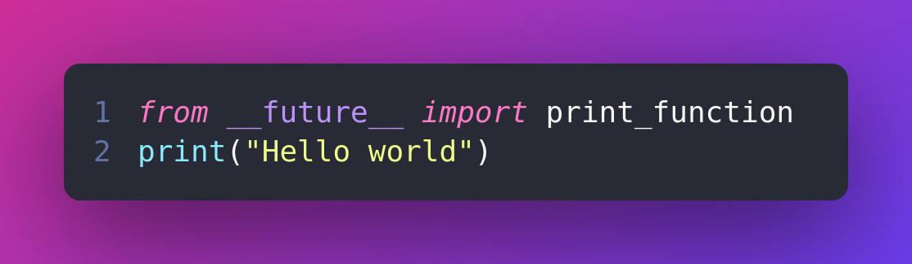](./Examples/2_example.py)

***Output***

> Hello world

***[Example 2:](./Examples/3_example.py)***

Here we are going to print the message in Python 2.X with end attributes that come in Python 3 and “end” appends string in a newline. And it will raise an error because the function is not compatible with 2.x.

[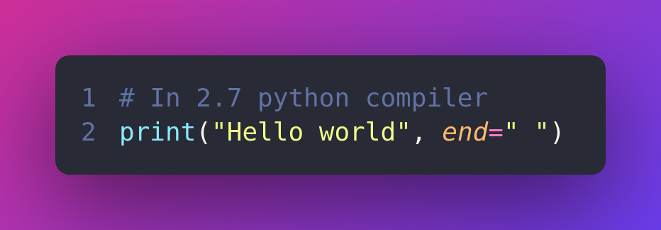](./Examples/3_example.py)

***Output***

[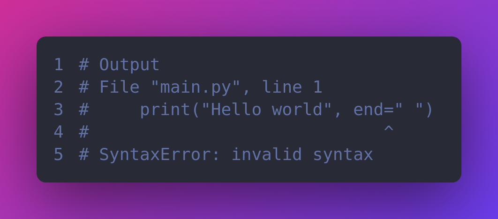](./Examples/3_example.py)

So with `__future__` print function we can import these features in our code to use the latest print function.

[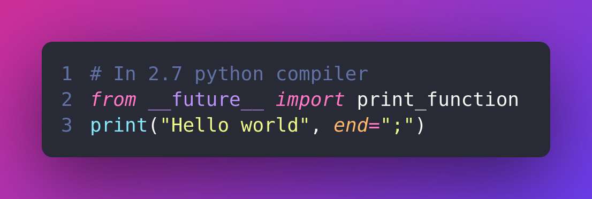](./Examples/4_example.py)

***Output***
> Hello world;

***[Example 3:](./Examples/5_example.py)***

sep also belongs to Python 3.x but here we will use these attributes by using this module. Let’s check these attributes without using the future modules.

[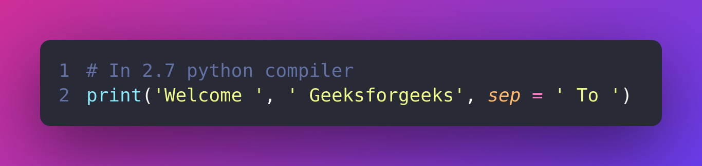](./Examples/5_example.py)

***Output***
[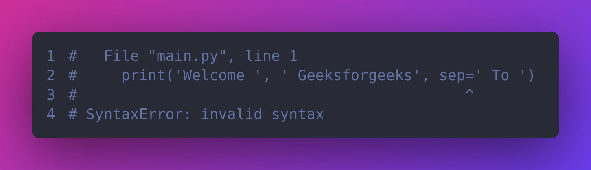](./Examples/5_example.py)

Then let’s use the `__future__` print function to use the sep attributes.

[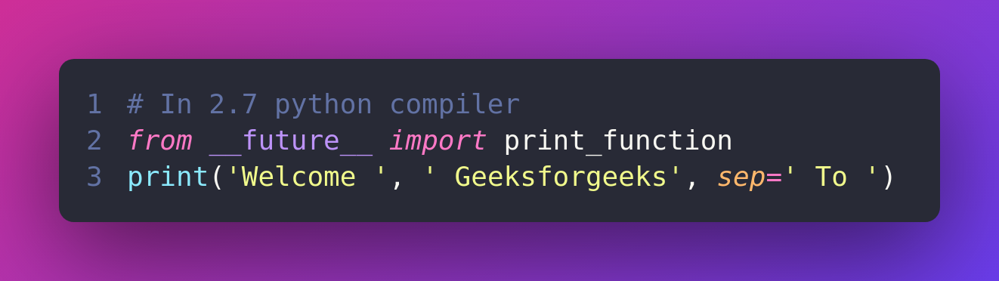](./Examples/6_example.py)

***Output***
> Welcome To Geeksforgeeks

### `__future__`  module with division function

Here we are going to use the division function in Python2.x and Python3.x.

Let’s see the example in Python2.x.

[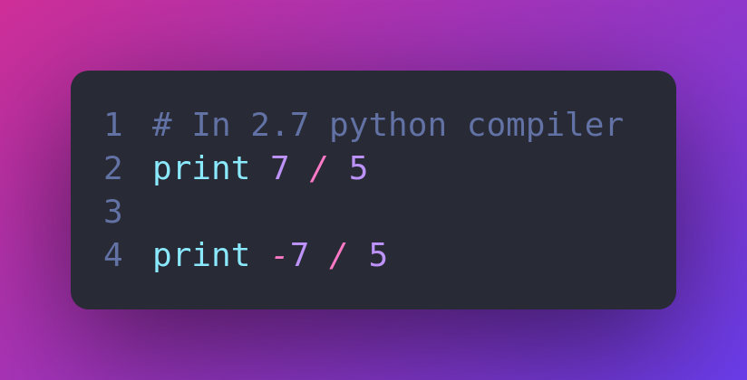](./Examples/7_example.py)

***Output***
> 1.4
>-1.4

And let see this with the future module, it will give you the accurate result.

[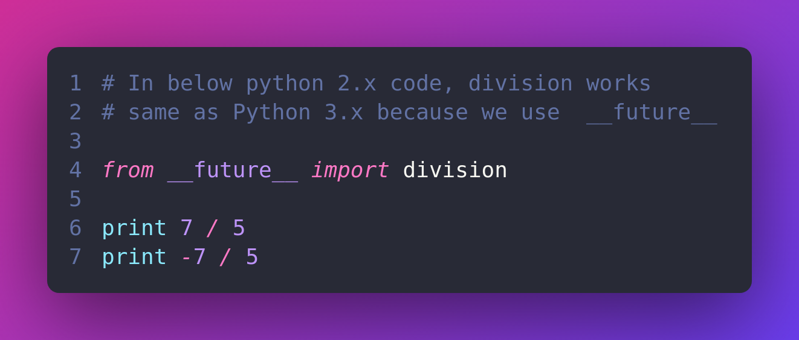](./Examples/9_example.py)

### `__future__`  module with [unicode_literals](https://www.geeksforgeeks.org/unicode_literals-in-python/) function

In Python2.x we can not use Unicode but future modules allow us to use Unicode.

***Example 1:***

In Python2 strings are considered bytes strings but in later versions, all strings are considered as a Unicode string.

[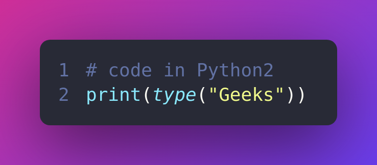](./Examples/10_example.py)

***Output***

> `<type 'str'>`

Let use the future module in Python2.

[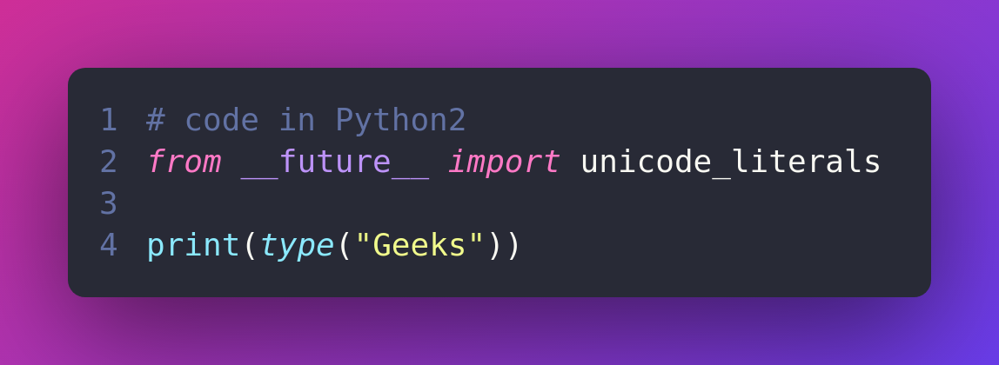](./Examples/11_example.py)

***Output***

> `<type 'unicode'>`

***Example 2:***

let’s see the example without future module, it will raise an error because we are building a byte string that holds UTF-8 encoded bytes

[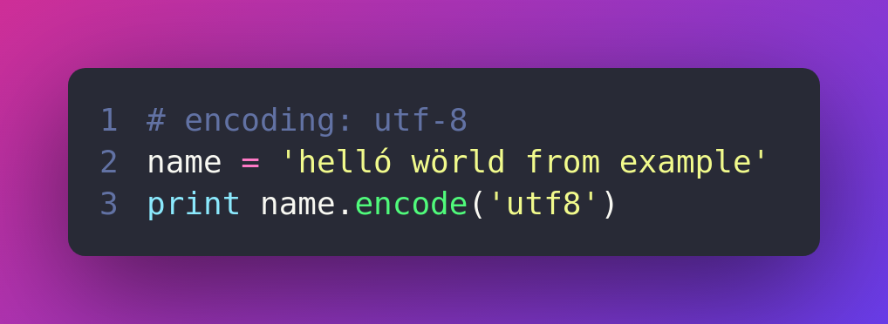](./Examples/12_example.py)

***Output***

[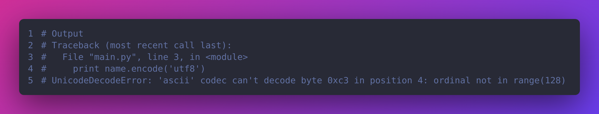](./Examples/12_example.py)

And it can be done in Python2X with future modules.

[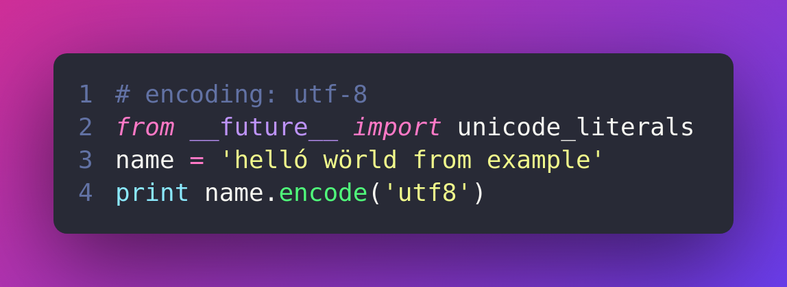](./Examples/13_example.py)

>***Reference***
>[geeksforgeeks](https://www.geeksforgeeks.org/__future__-module-in-python/)
