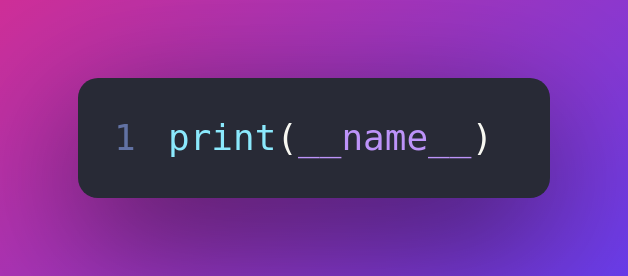

# `__main__` — Top-level code environment

In Python, the special name `__main__` is used for two important constructs:
    1. the name of the top-level environment of the program, which can be checked using the `__name__ == '__main__'` expression; and
    2. the `__main__.py` file in Python packages.

Both of these mechanisms are related to Python modules; how users interact with them and how they interact with each other. They are explained in detail below. If you’re new to Python modules, see the tutorial section [Modules](https://docs.python.org/3/tutorial/modules.html#tut-modules) for an introduction.

## `__name__ == '__main__'`

When a Python module or package is imported, `__name__` is set to the module’s name. Usually, this is the name of the Python file itself without the .py extension:

***Output***

> 'configparser'

If the file is part of a package, `__name__` will also include the parent package’s path:

However, if the module is executed in the top-level code environment, its `__name__` is set to the string `'__main__'`.

### What is the “top-level code environment”?

`__main__` is the name of the environment where top-level code is run. “Top-level code” is the first user-specified Python module that starts running. It’s “top-level” because it imports all other modules that the program needs. Sometimes “top-level code” is called an entry point to the application.

The top-level code environment can be:

- the scope of an interactive prompt:

***Output***

> `'__main__'`

- the Python module passed to the Python interpreter as a file argument:
- > `$ python3 helloworld.py`
- > Hello, world!

- the Python module or package passed to the Python interpreter with the [-m](https://docs.python.org/3/using/cmdline.html#cmdoption-m) argument:
- > `$ python3 -m tarfile`
- > `usage: tarfile.py [-h] [-v] (...)`
- Python code read by the Python interpreter from standard input:
- > `echo "import this" | python3`
- > The Zen of Python, by Tim Peters
- > Beautiful is better than ugly.
Explicit is better than implicit.
...

- Python code passed to the Python interpreter with the [-c](https://docs.python.org/3/using/cmdline.html#cmdoption-c) argument:
- > `$ python3 -c "import this"`
- > The Zen of Python, by Tim Peters
- > Beautiful is better than ugly.
Explicit is better than implicit.
...

In each of these situations, the top-level module’s `__name__` is set to `'__main__'`.

As a result, a module can discover whether or not it is running in the top-level environment by checking its own `__name__`, which allows a common idiom for conditionally executing code when the module is not initialized from an import statement:
  

> See also:  For a more detailed look at how `__name__` is set in all situations, see the tutorial section [Modules](https://docs.python.org/3/tutorial/modules.html#tut-modules).

## Idiomatic Usage

Some modules contain code that is intended for script use only, like parsing command-line arguments or fetching data from standard input. If a module like this was imported from a different module, for example to unit test it, the script code would unintentionally execute as well.

This is where using the if `__name__ == '__main__'` code block comes in handy. Code within this block won’t run unless the module is executed in the top-level environment.

Putting as few statements as possible in the block below if `__name___ == '__main__'` can improve code clarity and correctness. Most often, a function named main encapsulates the program’s primary behavior:

Note that if the module didn’t encapsulate code inside the main function but instead put it directly within the if `__name__ == '__main__'` block, the phrase variable would be global to the entire module. This is error-prone as other functions within the module could be unintentionally using the global variable instead of a local name. A main function solves this problem.

Using a main function has the added benefit of the echo function itself being isolated and importable elsewhere. When [echo.py](Examples/example_5.py) is imported, the echo and main functions will be defined, but neither of them will be called, because `__name__ != '__main__'`.

### Packaging Considerations

main functions are often used to create command-line tools by specifying them as entry points for console scripts. When this is done, pip inserts the function call into a template script, where the return value of main is passed into [`sys.exit()`](https://docs.python.org/3/library/sys.html#sys.exit). For example:

> `sys.exit(main())`

Since the call to main is wrapped in sys.exit(), the expectation is that your function will return some value acceptable as an input to sys.exit(); typically, an integer or None (which is implicitly returned if your function does not have a return statement).

By proactively following this convention ourselves, our module will have the same behavior when run directly (i.e. python3 [echo.py](Examples/example_5.py)) as it will have if we later package it as a console script entry-point in a pip-installable package.

In particular, be careful about returning strings from your main function. sys.exit() will interpret a string argument as a failure message, so your program will have an exit code of 1, indicating failure, and the string will be written to [sys.stderr](https://docs.python.org/3/library/sys.html#sys.stderr). The [echo.py](Examples/example_5.py) example from earlier exemplifies using the `sys.exit(main())` convention.

> See also: [Python Packaging User Guide](https://packaging.python.org/) contains a collection of tutorials and references on how to distribute and install Python packages with modern tools.

### `__main__`.py in Python Packages

If you are not familiar with Python packages, see section [Packages](https://docs.python.org/3/tutorial/modules.html#tut-packages) of the tutorial. Most commonly, the `__main__.py` file is used to provide a command-line interface for a package. Consider the following hypothetical package, “bandclass”:

> bandclass
> ├── `__init__.py`
> ├── `__main__.py`
> └── `student.py`

`__main__.py` will be executed when the package itself is invoked directly from the command line using the -m flag. For example:

> `$ python3 -m bandclass`

This command will cause `__main__.py` to run. How you utilize this mechanism will depend on the nature of the package you are writing, but in this hypothetical case, it might make sense to allow the teacher to search for students:

Note that `from .student import search_students` is an example of a relative import. This import style can be used when referencing modules within a package. For more details, see [Intra-package](https://docs.python.org/3/tutorial/modules.html#intra-package-references) References in the Modules section of the tutorial.

### Idiomatic Usage

The contents of `__main__.py` typically isn’t fenced with if `__name__ == '__main__'` blocks. Instead, those files are kept short, functions to execute from other modules. Those other modules can then be easily unit-tested and are properly reusable.

If used, an if `__name__ == '__main__'` block will still work as expected for a `__main__.py` file within a package, because its `__name__` attribute will include the package’s path if imported:

***Output***

> `'asyncio.__main__'`

This won’t work for `__main__.py` files in the root directory of a .zip file though. Hence, for consistency, minimal `__main__.py` like the venv one mentioned below are preferred.

> See also: See venv for an example of a package with a minimal `__main__.py` in the standard library. It doesn’t contain a if `__name__ == '__main__'` block. You can invoke it with python3 -m venv [directory]. 
> See [runpy](https://docs.python.org/3/library/runpy.html#module-runpy) for more details on the -m flag to the interpreter executable.
> See [zipapp](https://docs.python.org/3/library/zipapp.html#module-zipapp) for how to run applications packaged as .zip files. In this case Python looks for a `__main__.py` file in the root directory of the archive.

## `import __main__`

Regardless of which module a Python program was started with, other modules running within that same program can import the top-level environment’s scope ([namespace](https://docs.python.org/3/glossary.html#term-namespace)) by importing the `__main__` module. This doesn’t import a `__main__`.py file but rather whichever module that received the special name `'__main__'`.

Here is an example module that consumes the `__main__` namespace:

Example usage of this module could be as follows:

Now, if we started our program, the result would look like this:

***Run start.py***
> `$ python3 start.py`

***Output***

> Define the variable `'my_name'`!

The exit code of the program would be 1, indicating an error. Uncommenting the line with `my_name = "Dinsdale"` fixes the program and now it exits with status code 0, indicating success:

***Run start.py***

> `$ python3 start.py`

***Output***
> Dinsdale found in file /path/to/start.py

Note that importing `__main__` doesn’t cause any issues with unintentionally running top-level code meant for script use which is put in the if `__name__ == "__main__"` block of the start module. Why does this work?

Python inserts an empty `__main__` module in [sys.modules](https://docs.python.org/3/library/sys.html#sys.modules) at interpreter startup, and populates it by running top-level code. In our example this is the start module which runs line by line and imports namely. In turn, namely imports `__main__` (which is really start). That’s an import cycle! Fortunately, since the partially populated `__main__` module is present in sys.modules, Python passes that to namely. See [Special considerations for `__main__`](https://docs.python.org/3/reference/import.html#import-dunder-main) in the import system’s reference for details on how this works.

The Python REPL is another example of a “top-level environment”, so anything defined in the REPL becomes part of the `__main__` scope:

> `>>> import namely`
> `>>> namely.did_user_define_their_name()`
> **False**
> `>>> namely.print_user_name()`
> Traceback (most recent call last):
> ...
> ValueError: Define the variable `my_name`!
> `>>> my_name = 'Jabberwocky'`
> `>>> namely.did_user_define_their_name()`
> **True**
> `>>> namely.print_user_name()`
> Jabberwocky

Note that in this case the `__main__` scope doesn’t contain a `__file__` attribute as it’s interactive.

The `__main__` scope is used in the implementation of pdb and rlcompleter.

>***Reference***
>[Docs Python](https://docs.python.org/3/library/__main__.html)
