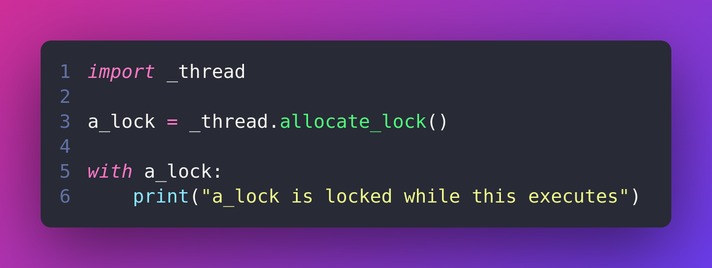
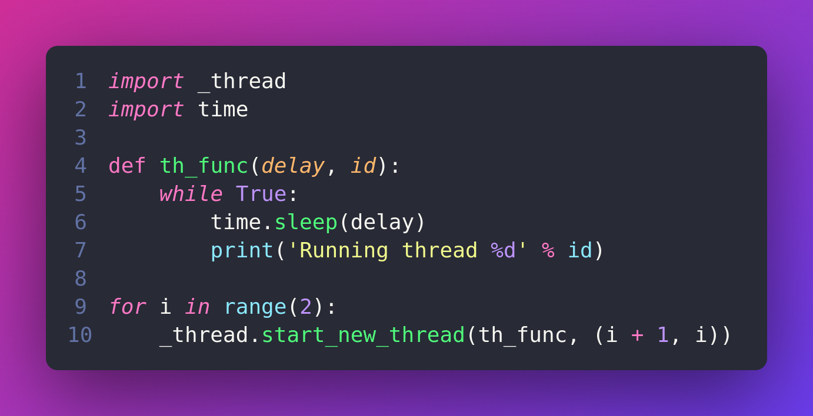
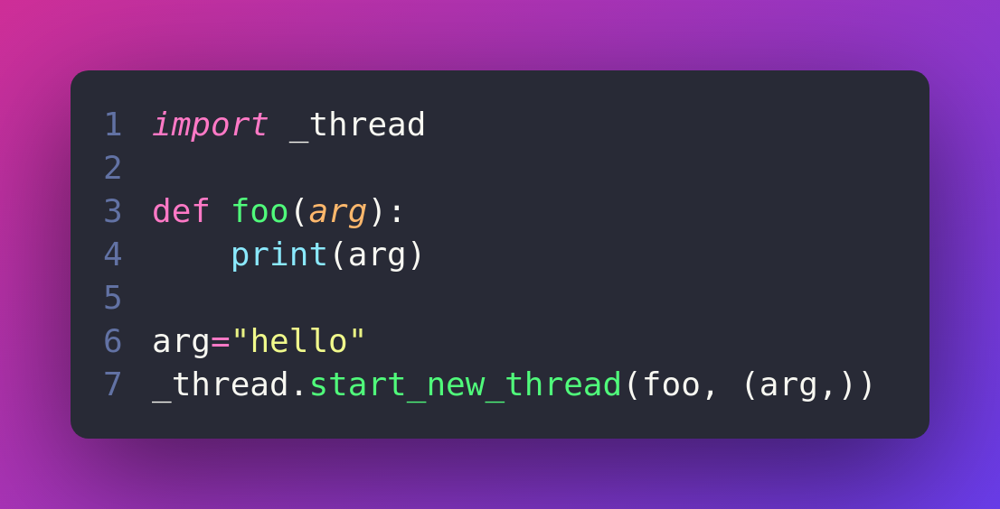

# `_thread` — Low-level threading API

his module provides low-level primitives for working with multiple threads (also called light-weight processes or tasks) — multiple threads of control sharing their global data space. For synchronization, simple locks (also called mutexes or binary semaphores) are provided. The [threading](https://docs.python.org/3/library/threading.html#module-threading) module provides an easier to use and higher-level threading API built on top of this module.

Changed in version 3.7: This module used to be optional, it is now always available.

This module defines the following constants and functions:

- exception `_thread.error`

    Raised on thread-specific errors.

    Changed in version 3.3: This is now a synonym of the built-in [RuntimeError](https://docs.python.org/3/library/exceptions.html#RuntimeError).

- `_thread.LockType`

    This is the type of lock objects.

- `_thread.start_new_thread(function, args[, kwargs])`

    Start a new thread and return its identifier. The thread executes the function function with the argument list args (which must be a tuple). The optional kwargs argument specifies a dictionary of keyword arguments.

    When the function returns, the thread silently exits.
    When the function terminates with an unhandled exception, [`sys.unraisablehook()`](https://docs.python.org/3/library/sys.html#sys.unraisablehook) is called to handle the exception. The object attribute of the hook argument is function. By default, a stack trace is printed and then the thread exits (but other threads continue to run).

    When the function raises a [SystemExit](https://docs.python.org/3/library/exceptions.html#SystemExit) exception, it is silently ignored.

    Changed in version 3.8: [`sys.unraisablehook()`](https://docs.python.org/3/library/sys.html#sys.unraisablehook) is now used to handle unhandled exceptions.

- `_thread.interrupt_main(signum=signal.SIGINT, /)`

     Simulate the effect of a signal arriving in the main thread. A thread can use this function to interrupt the main thread, though there is no guarantee that the interruption will happen immediately.

     If given, signum is the number of the signal to simulate. If signum is not given, [`signal.SIGINT`](https://docs.python.org/3/library/signal.html#signal.SIGINT) is simulated.

     If the given signal isn’t handled by Python (it was set to [`signal.SIG_DFL`](https://docs.python.org/3/library/signal.html#signal.SIG_DFL) or [`signal.SIG_IGN`](https://docs.python.org/3/library/signal.html#signal.SIG_IGN)), this function does nothing.

     Changed in version 3.10: The signum argument is added to customize the signal number.
     > Note: This does not emit the corresponding signal but schedules a call to the associated handler (if it exists). If you want to truly emit the signal, use [`signal.raise_signal()`](https://docs.python.org/3/library/signal.html#signal.raise_signal).

- `_thread.exit()`
    Raise the [`SystemExit`](https://docs.python.org/3/library/exceptions.html#SystemExit) exception. When not caught, this will cause the thread to exit silently.

- `_thread.allocate_lock()`

    Return a new lock object. Methods of locks are described below. The lock is initially unlocked.

- `_thread.get_ident()`

    Return the ‘thread identifier’ of the current thread. This is a nonzero integer. Its value has no direct meaning; it is intended as a magic cookie to be used e.g. to index a dictionary of thread-specific data. Thread identifiers may be recycled when a thread exits and another thread is created.

- `_thread.get_native_id()`

    Return the native integral Thread ID of the current thread assigned by the kernel. This is a non-negative integer. Its value may be used to uniquely identify this particular thread system-wide (until the thread terminates, after which the value may be recycled by the OS).

    [Availability](https://docs.python.org/3/library/intro.html#availability): Windows, FreeBSD, Linux, macOS, OpenBSD, NetBSD, AIX.

    New in version 3.8.

- `_thread.stack_size([size])`

    Return the thread stack size used when creating new threads. The optional size argument specifies the stack size to be used for subsequently created threads, and must be 0 (use platform or configured default) or a positive integer value of at least 32,768 (32 KiB). If size is not specified, 0 is used. If changing the thread stack size is unsupported, a [RuntimeError](https://docs.python.org/3/library/exceptions.html#RuntimeError) is raised. If the specified stack size is invalid, a [ValueError](https://docs.python.org/3/library/exceptions.html#ValueError) is raised and the stack size is unmodified. 32 KiB is currently the minimum supported stack size value to guarantee sufficient stack space for the interpreter itself. Note that some platforms may have particular restrictions on values for the stack size, such as requiring a minimum stack size > 32 KiB or requiring allocation in multiples of the system memory page size - platform documentation should be referred to for more information (4 KiB pages are common; using multiples of 4096 for the stack size is the suggested approach in the absence of more specific information).

    [Availability](https://docs.python.org/3/library/intro.html#availability): Windows, pthreads.

    Unix platforms with POSIX threads support.

- `_thread.TIMEOUT_MAX`

    The maximum value allowed for the timeout parameter of Lock.acquire(). Specifying a timeout greater than this value will raise an [OverflowError](https://docs.python.org/3/library/exceptions.html#OverflowError).

    New in version 3.2.

Lock objects have the following methods:

- `lock.acquire(blocking=True, timeout=- 1)`
      Without any optional argument, this method acquires the lock unconditionally, if necessary waiting until it is released by another thread (only one thread at a time can acquire a lock — that’s their reason for existence).

    If the blocking argument is present, the action depends on its value: if it is False, the lock is only acquired if it can be acquired immediately without waiting, while if it is True, the lock is acquired unconditionally as above.

    If the floating-point timeout argument is present and positive, it specifies the maximum wait time in seconds before returning. A negative timeout argument specifies an unbounded wait. You cannot specify a timeout if blocking is False.

    The return value is True if the lock is acquired successfully, False if not.

    Changed in version 3.2: The timeout parameter is new.

    Changed in version 3.2: Lock acquires can now be interrupted by signals on POSIX.

- `lock.release()`

    Releases the lock. The lock must have been acquired earlier, but not necessarily by the same thread.

- `lock.locked()`

    Return the status of the lock: True if it has been acquired by some thread, False if not.

In addition to these methods, lock objects can also be used via the [with](https://docs.python.org/3/reference/compound_stmts.html#with) statement, e.g.:

### Caveats:

- Threads interact strangely with interrupts: the [KeyboardInterrupt](https://docs.python.org/3/library/exceptions.html#KeyboardInterrupt) exception will be received by an arbitrary thread. (When the [signal](https://docs.python.org/3/library/signal.html#module-signal) module is available, interrupts always go to the main thread.)

- Calling [`sys.exit()`](https://docs.python.org/3/library/sys.html#sys.exit) or raising the [SystemExit](https://docs.python.org/3/library/exceptions.html#SystemExit) exception is equivalent to calling [`_thread.exit()`](https://docs.python.org/3/library/_thread.html#thread.exit).

- It is not possible to interrupt the acquire() method on a lock — the [KeyboardInterrupt](https://docs.python.org/3/library/exceptions.html#KeyboardInterrupt) exception will happen after the lock has been acquired.

- When the main thread exits, it is system defined whether the other threads survive. On most systems, they are killed without executing [try](https://docs.python.org/3/reference/compound_stmts.html#try) … [finally](https://docs.python.org/3/reference/compound_stmts.html#finally) clauses or executing object destructors.

- When the main thread exits, it does not do any of its usual cleanup (except that [try](https://docs.python.org/3/reference/compound_stmts.html#try) … [finally](https://docs.python.org/3/reference/compound_stmts.html#finally) clauses are honored), and the standard I/O files are not flushed.

[docs.python.org](https://docs.python.org/3/library/_thread.html#module-_thread)

## Another example from the others website's:

- [ref](https://mpython.readthedocs.io/en/master/library/micropython/_thread.html)

[Read more ...](AboutThread/README.md)
